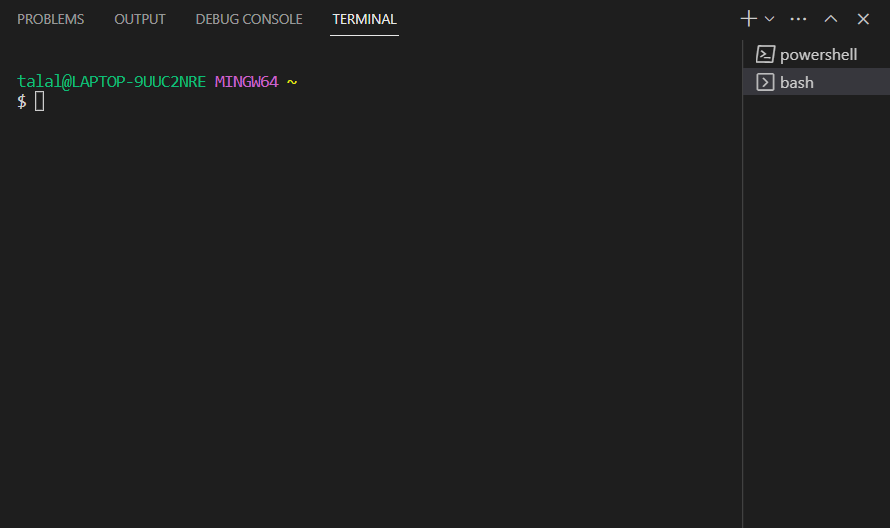

**Hello World!**

This is a tutorial on how to log onto your course specific account on `ieng6`

* Installing VScode

Since I already had VScode on my system, I'll leave an installation and configuration link right below. Follow the instructions for your specific operating system.

[Setting up Visual Studio Code](https://code.visualstudio.com/docs/setup/windows#:~:text=Download%20the%20Visual%20Studio%20Code,%5CPrograms%5CMicrosoft%20VS%20Code%20.)

On launch, VScode should look similar to this:

* Remotely Connecting

Before we can proceed to remote connection, we must download and install `git`. Git supplies us with useful tools for terminal operations. This step does not apply to Mac users as Mac systems already have git installed. The link is provided below:

[Git Download](https://gitforwindows.org/)

To use git Bash on Windows in VScode:

  * Launch VScode and press `Ctrl` + `Shift` + `
  * Click the dropdown arrow and select `Git Bash (Default)`
  * Your terminal should now be git bash ready!

To connect to the server, type the following command in the terminal: `$ ssh cs15lsp23zz@ieng6.ucsd.edu`
Since it is your first time connecting to the server, you will be prompted with

 
