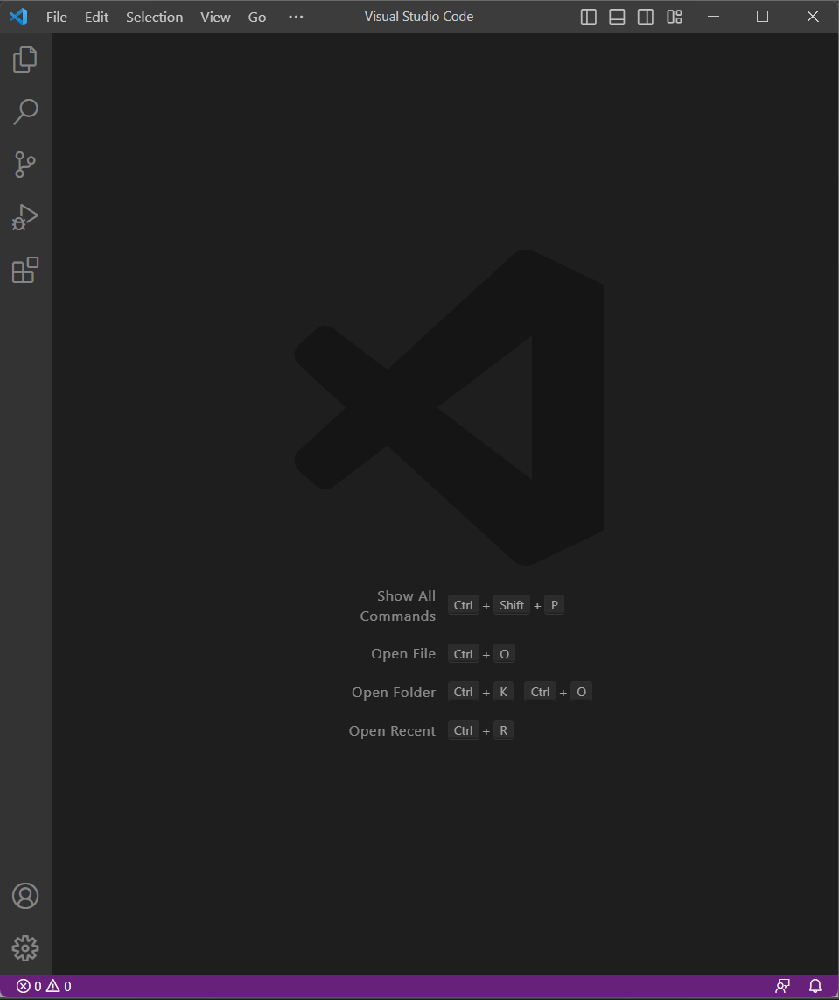
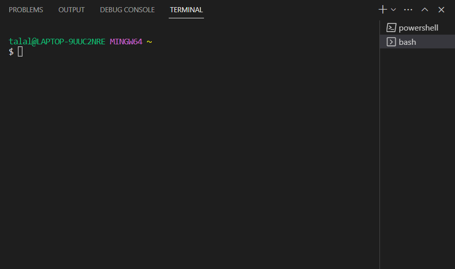
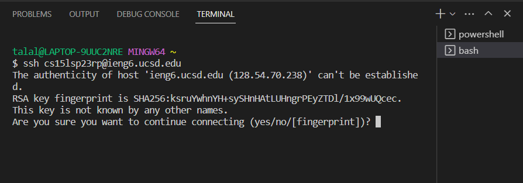
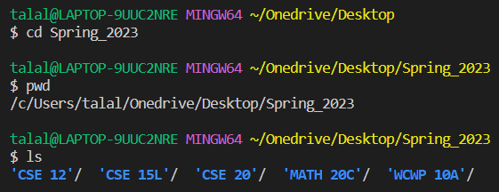

**Hello World!**

This is a tutorial on how to log onto your course specific account on `ieng6`

## Installing VScode

Since I already had VScode on my system, I'll leave an installation and configuration link right below. Follow the instructions for your specific operating system.

[Setting up Visual Studio Code](https://code.visualstudio.com/docs/setup/windows#:~:text=Download%20the%20Visual%20Studio%20Code,%5CPrograms%5CMicrosoft%20VS%20Code%20.)

On launch, VScode should look similar to this:

## Remotely Connecting

Before we can proceed to remote connection, we must download and install `git`. Git supplies us with useful tools for terminal operations. This step does not apply to Mac users as Mac systems already have git installed. The link is provided below:

[Git Download](https://gitforwindows.org/)

To use git Bash on Windows in VScode:

  * Launch VScode and press `Ctrl` + `Shift` + `
  * Click the dropdown arrow and select `Git Bash (Default)`
  * Your terminal should now be git bash ready!

To connect to the server, type the following command in the terminal: `$ ssh cs15lsp23zz@ieng6.ucsd.edu`
Since it is your first time connecting to the server, you will be prompted with a message similar to the following:

Right after typing yes, you'll be prompted to enter your account password. The characters won't show up in the terminal whilst you are typing the password. That is a normal occurence. 

To log out of the remote server, any of the following may be used:

 * `Ctrl` + `D`
 * `exit` command

## Running Commands

Now that we're all set up, let's try running a few useful commands. Here are some key commands you'll be using often:

* `cat` <path1> <path2> ... (Concatenate)
  * Prints the contents of one or more files given by the paths
* `ls` <path> (List)
  * Lists files and folders of a given path
* `pwd` (Print Working Directory)
  * Displays the current working directory
* `cd` <path> (Change Directory)
  * Switches current working directory to the given path

Here's an example of how to use some of the aforementioned commands and what results to expect:

 
